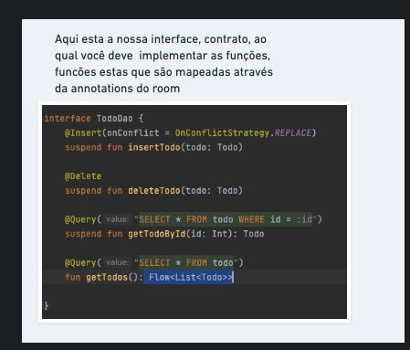
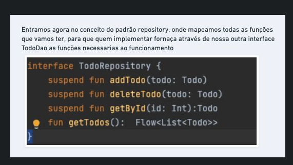

# DslSetup

Você está cansado de comprar cursos e na hora de colocar suas dependências elas não compilarem,
ou mostram um erro 'bizonho' na LogCat/Terminal?
Seus problemas acabaram, com este setup ficou tudo mais fácil.

##Kotlin Dsl Gradle
##O Kotlin DSL do Gradle fornece uma sintaxe alternativa ao
##Groovy DSL tradicional com uma experiência de edição aprimorada
##em IDEs suportados, com assistência de conteúdo superior, refatoração,
##documentação e muito mais. Este capítulo fornece detalhes das principais
##construções de DSL Kotlin e como usá-las para interagir com a API Gradle.

```
Como usar:
  1 - Clone o projeto
  2 - vá na pasta buildSrc e adicione ou  remova as libs que vc deseja em seu projeto
  3 - vá em build.gradle(:app) e remova ou adicione as libs que vc adicionou ou removeu acima (item 2)
```
Obs: Se nada funcionar, você tem o dever de Fazer um PR (Pull Request) para corrigir

# Passo 1

# Passo 2

# Passo 3

# Passo 4

# Passo 5

# Passo 6


#Vem comigo 
